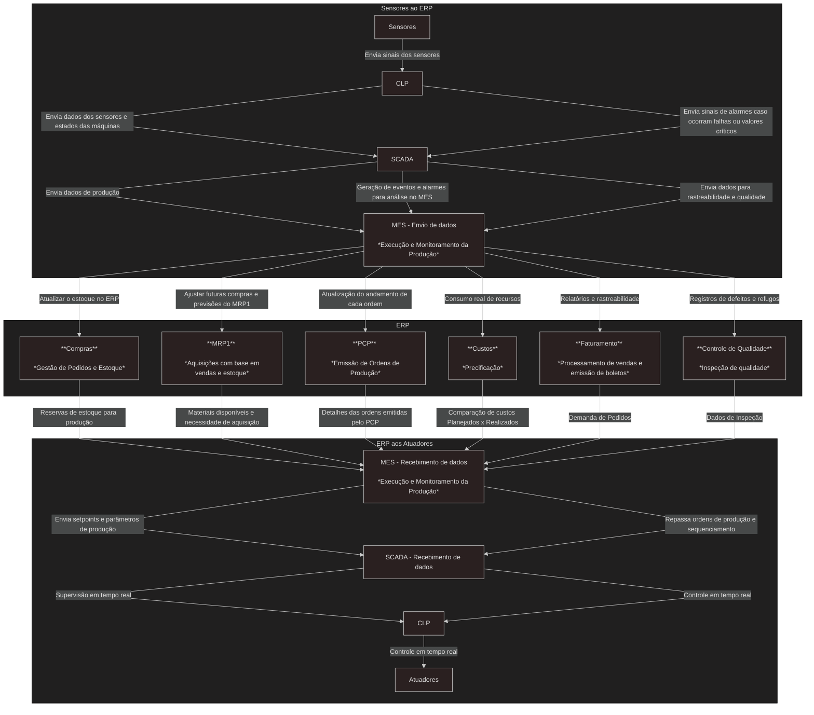

# Levantamento de Módulos e Integrações

Uma indústria de fabricação possui uma linha de produção automatizada que inclui esteiras transportadoras, robôs para montagem, CLPs (Controladores Lógicos Programáveis), além de sensores e atuadores para controle de processos. O objetivo é garantir a eficiência, rastreabilidade e integração entre os diferentes sistemas utilizados na empresa.

## Diagrama de integração entre módulos e sistemas
O diagrama centraliza o ERP e acima temos o processo de informações dos `Sensores ao ERP`, e abaixo do `ERP aos Atuadores`

## Benefícios e desafios no contexto de Industria 4.0