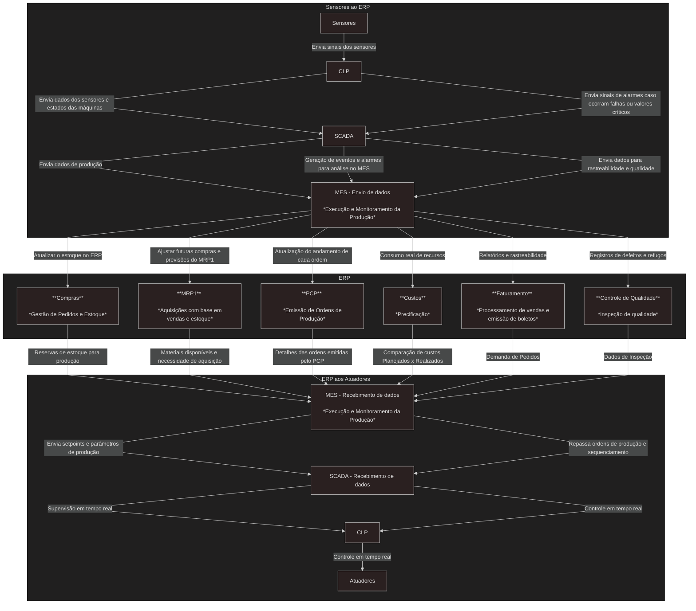

**Colaboradores** - *Lucas Leite, Ricardo Silva, Kauan Izidoro, Gabriel Alvim, Gustavo Monteiro e Gustavo Sousa*.

# Levantamento de Módulos e Integrações

Uma indústria de fabricação possui uma linha de produção automatizada que inclui esteiras transportadoras, robôs para montagem, CLPs (Controladores Lógicos Programáveis), além de sensores e atuadores para controle de processos. O objetivo é garantir a eficiência, rastreabilidade e integração entre os diferentes sistemas utilizados na empresa.

## Diagrama de integração entre módulos e sistemas
O diagrama centraliza o ERP e acima temos o processo de informações dos `Sensores ao ERP`, e abaixo do `ERP aos Atuadores`

 

## Benefícios e Desafios no Contexto de Industria 4.0

### **Benefícios**

**1. Maior Eficiência Operacional**

- A integração entre sistemas *ERP*, *MES*, *SCADA* e *CLPs* permite um fluxo contínuo de dados, otimizando decisões e reduzindo desperdícios
- Automatização do sequenciamento de ordens de produção evitando gargalos e melhorando a produtividade.

**2. Melhoria na Rastreabilidade e Qualidade**

- Sensores e CLPs fornecem dados em tempo real sobre condições operacionais, facilitando a rastreabilidade de produtos
- Registros detalhados que ajudam a identificar falhas e aprimorar o controle de qualidade.

**3. Otimização de Recursos e Redução de Custos**

- Monitoramento de consumo de materiais e comparação de custos planejados x realizados na gestão financeira e mitigando desperdícios.
- Ajustes em tempo real garantem um melhor aproveitamento da capacidade produtiva.

**4. Monitoramento Remoto e Supervisão em Tempo Real**

- O uso de SCADA permite visualizar o status das máquinas e processos remotamente, facilitando a manutenção preditiva e evitando paradas inesperadas.

**5. Automação Inteligente e Resposta Rápida a Falhas**

- O sistema possibilita detectar falhas automaticamente e aciona alarmes no SCADA, permitindo respostas mais rápidas e reduzindo impactos na produção.

 

### **Desafios**

**1. Complexidade na Integração dos Sistemas**

- Sistemas legados podem ter dificuldades em se comunicar com novas tecnologias, exigindo personalização e investimentos em *middleware*.

**2. Segurança Cibernética**

- A interconexão de sistemas aumenta a superfície de ataque, exigindo medidas robustas de segurança para evitar invasões e ou sabotagens.

**3. Alto Custo Inicial de Implementação**

- A aquisição e integração de sensores, *CLPs*, *MES* e *SCADA* podem representar um custo elevado, demandando um planejamento financeiro sólido.

**4. Dependência de Infraestrutura Tecnológica**

- A necessidade de conectividade estável e armazenamento de dados eficiente pode exigir melhorias na infraestrutura de TI da empresa.

**5. Treinamento e Adoção pela Equipe**

- A transição para um modelo digital exige treinamento e capacitação dos operadores e gestores para garantir que os benefícios da automação sejam totalmente aproveitados.

 

## Conclusão

A Indústria 4.0 traz avanços significativos na automação e digitalização dos processos produtivos, proporcionando maior eficiência, qualidade e controle operacional. No entanto, sua implementação requer planejamento estratégico para superar desafios como integração de sistemas, segurança, custos e adaptação da equipe.

Para um sucesso sustentável, as empresas devem investir em tecnologias abertas, infraestrutura robusta e capacitação contínua, garantindo que os benefícios da automação sejam plenamente aproveitados.